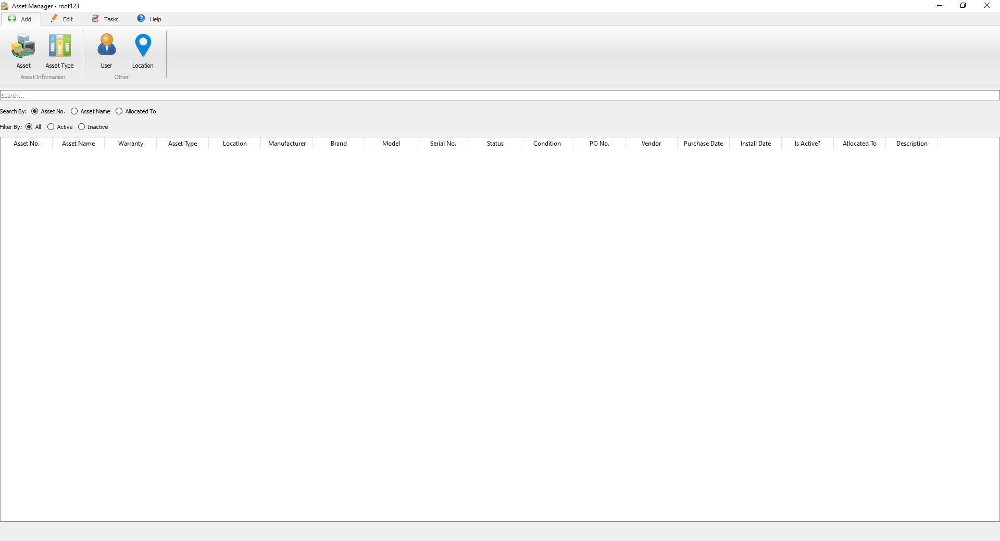
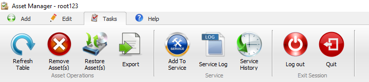
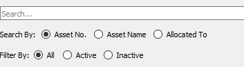

# Introduction
Asset Manager is a desktop application used for Asset Management.
# Setup
Perform the following steps to run the application:
* Download the source code
* Install the dependencies
  ```
    pip install PyQt5
    pip install pandas
    pip install mysql-connector-python
  ```
* Create a database named `asset`
* Execute all the queries in the [sql file](https://github.com/Rahul-Mac/asset-manager/blob/main/db_file.sql)
* Replace all occurences of `GMIT.LHDOMAIN.LOCAL` to the name of your MySQL host in the source code files.
* Run
  ```
    python main.py
  ```
# Login

<br><br>
This is the login screen
* Username: root123
* Password: root123
# Home screen

<br><br>
This is the home screen. It consists of:
* Ribbon Bar
* Search Bar with category and filters
* Log
## Add

<br><br>
The "Add" Ribbon page has 2 Ribbon Groups:
* Asset Information:
  * Asset - Multiple entries are needed to be filled which consists of Name, PO No., Serial No, Warranty, etc.
  * Asset Type - Enter the name of the asset (should be unique).
* Other:
  * User - Enter the username (should be unique) and password. Both should be at least 6 characters long.
  * Location - Enter the name of the location. Selected the floor and wing (optional)
<br>

***The "Is Active?" Chceckbox***
<br>
* **_If you check it, it means that it is available and will be visible as a field while adding asset information_**
* **_If you uncheck it, it means that it is deleted, however, it can be restored by editing_**
## Edit

<br><br>
The "Edit" Ribbon page has 2 Ribbon Groups:
* Asset & Location:
  * Asset Type - Double click on the asset in the list pop up to edit the asset information.
  * Asset - Select the asset from the main log and then click on this button.
  * Location - Double click on the location in the list pop up to edit the location information.
* User:
  * User Activation - Double click on the user in the list pop to enable/disable the user.
  * Reset Password - Select the user whose password you wish to reset.
## Tasks

<br><br>
The "Tasks" Ribbon page has 3 Ribbon Groups:
* Asset Operations:
  * Refresh Table - Get lastest updated information on the main log.
  * Remove Asset(s) - Select the asset from the main log and then click on this button. (Multiple selection is allowed)
  * Restore Asset(s) - Select the asset from the main log and then click on this button. (Multiple selection is allowed)
  * Export - Enter the required details and click on "Export" button to generate a .xlsx file which contains information about assets.
* Service:
  * Add To Service - Select the asset from the main log and then click on this button. Enter the details and Save it to put the asset into servicing mode.
  * Service Log - Displays the list of assets currently under servicing.
  * Service History - Displays the list of assets whose servicing has been completed.
* Exit Session:
  * Log Out - Logs out the current user and opens the login screen.
  * Quit - Closes the application.
## Help

<br><br>
The "Help" Ribbon page has 2 Ribbon Groups:
* Information:
  * About - Brief information about the software.
  * License - License notice of the software
* How To Use:
  * Manual - A short manual of the software.
# Search Bar

<br><br>
The search bar populates data on the main log.
<br>
User can "Search By":
* Asset No.
* Asset Name
* Allocated To

User can filter the main log by:

* All assets
* Active assets
* Inactive assets
<br>

# Main Log

Displays information about the assets
